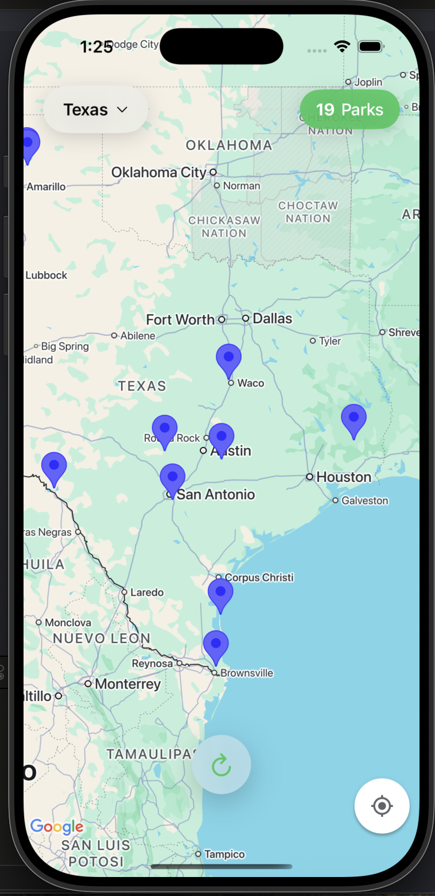

# My Project

This is an ongoing iOS app project that shows outdoor activities near you.
For now, it is just a basic Google map view that shows parks in Texas using
the nps public api. As the project is ongoing will be adding more
features and more data all over the US.

## ScreenShot

Here is the App Screenshot:

  

## Functionality
- Async code for fetching data from the nps public api
- MapView that shows parks in Texas
- Search bar to filter parks by name
- TableView that shows details of the selected park

## Future Plans
- Add more data such as hiking trails, beaches, etc.
                    
